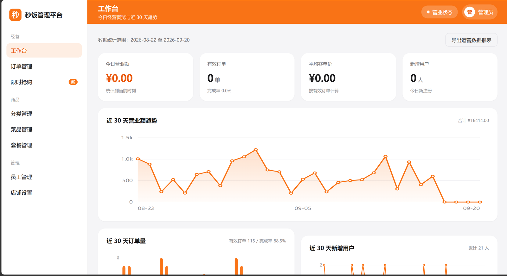
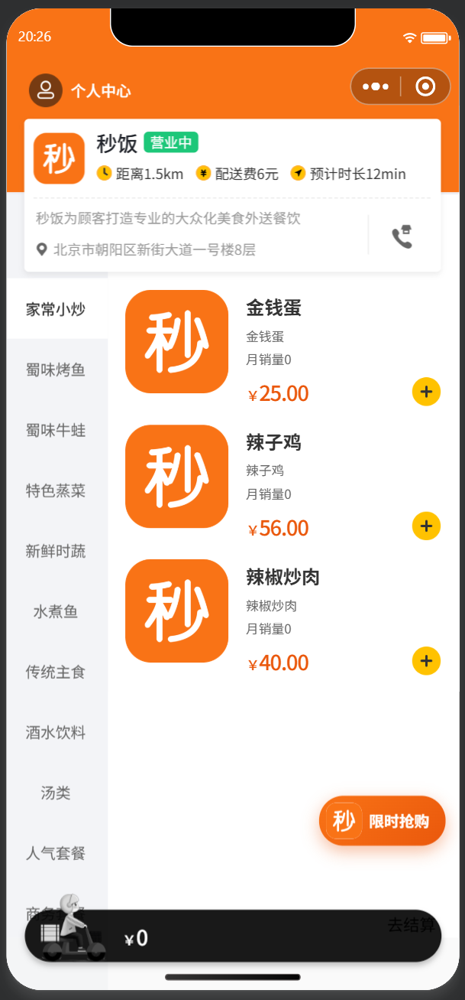
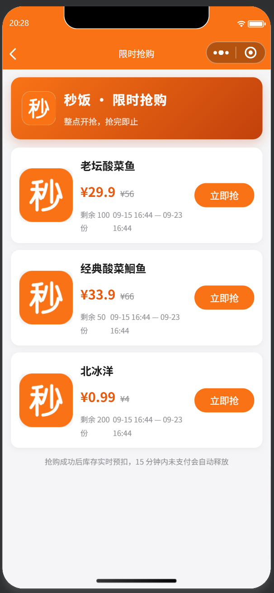

# 秒饭 miao-fan-takeout

外卖点餐系统的完整实现：管理端后台 + 用户端微信小程序 + Spring Boot 后端 + MySQL / Redis。

除了完整的点餐业务闭环（登录、菜品套餐、购物车、下单支付、订单流转、数据统计、来单提醒），项目还实现了一条**限时特价抢购**的高并发链路，作为技术重点：

```
用户请求 -> 令牌桶限流(每用户 5 突发 / 1 QPS)
        -> Lua 原子校验与预扣库存(Redis)
        -> 写"排队中"结果 + XADD 投递消息
        -> 立即返回"排队中"
        -> 消费者: 唯一索引幂等 -> DB 乐观扣减 -> 生成订单 -> 回写结果 -> XACK
        -> 前端轮询 /user/seckill/result/{activityId} 拿最终结果
```

三道防线：Redis + Lua 原子扣减挡住并发超卖；`update ... where sold_stock < total_stock` 在缓存与数据库不一致时兜底；`seckill_record(activity_id, user_id)` 唯一索引挡住重复消息与绕过 Redis 的重复抢购。

## 技术栈

| 模块 | 技术 |
| --- | --- |
| 后端 | Spring Boot 2.7.3、MyBatis、MySQL 8、Redis、Druid、Knife4j(Swagger)、JWT、WebSocket、POI |
| 抢购链路 | Redis + Lua 原子脚本、令牌桶限流、Redis Stream 消息队列、延迟任务、定时对账 |
| 管理端 | 单页应用（构建产物由 nginx 托管，图表手写 SVG，不依赖图表库） |
| 用户端 | uni-app 编译的微信小程序（mp-weixin） |
| 网关 | nginx 反向代理 |

## 本机压测结果（单机，非生产数据）

同一接口、200 并发抢 200 库存，只切换同步落库与异步削峰：

| 指标 | 同步落库 | 异步削峰 |
| --- | --- | --- |
| QPS | 42.4 | **144.4** |
| 平均响应 | 3036 ms | 1303 ms |
| P99 | 4680 ms | **1378 ms** |
| 全部落库 | 22 ms | 4828 ms |
| 成功 / 异常 | 200 / 0 | 200 / 0 |

两个模式下库存都没有超卖。复现：`powershell -File scripts\bench-seckill.ps1`（自动构建、分别以两种模式启动应用并各压一轮）。方法与局限见 `docs/压测报告.md`。

## 目录结构

```
miao-fan-takeout/
├── backend/miao-fan-takeout/     后端 Maven 多模块工程（mf-common / mf-pojo / mf-server）
├── frontend-miniprogram/         用户端微信小程序
├── nginx/                        nginx 1.20.2 for Windows（含 nginx.exe，克隆即可用）
│   ├── conf/nginx.conf           监听 18001，/api/ 反代到后端 18080
│   └── html/miaofan/             管理端前端静态资源
├── db/
│   ├── miao_fan_takeout.sql      建库建表 + 基础数据（分类、24 道菜、管理员账号）
│   ├── seckill.sql               抢购活动建表 + 示例活动（幂等，可重复执行）
│   ├── demo_data.sql             演示订单数据（可重复执行，只清理自己造的数据）
│   └── rollback_seckill.sql      抢购相关表回滚
├── docs/
│   ├── 数据库设计文档.md
│   └── 压测报告.md
├── scripts/
│   ├── bench-seckill.ps1         压测编排脚本
│   └── gen-logo.py               品牌标识生成（幼圆字形转矢量，一条命令重出全部尺寸）
├── 启动项目.bat                  一键：构建后端 -> 启动后端 -> 启动 nginx -> 打开浏览器
├── 启动后端.bat                  只启动后端（缺 jar 会自动构建一次）
└── 停止项目.bat                  停 nginx 与后端进程
```

## 环境要求

| 依赖 | 版本 | 说明 |
| --- | --- | --- |
| JDK | **17+** | pom 里 `maven.compiler.release=17` |
| MySQL | 8.x | 默认 `localhost:3306` |
| Redis | 任意 | 默认 `localhost:6379`，抢购链路依赖它 |
| Maven | 3.6+ | |
| nginx | —— | 仓库内已自带 Windows 版，无需另装 |
| 微信开发者工具 | —— | 只跑小程序时需要 |

**项目所在路径不要含中文**，否则 nginx 无法启动。

## 快速开始（Windows）

### 1. 初始化数据库

```bash
mysql -uroot -p < db/miao_fan_takeout.sql     # 建库建表 + 基础数据
mysql -uroot -p < db/seckill.sql              # 抢购活动表 + 示例活动（可选）
mysql -uroot -p < db/demo_data.sql            # 演示订单数据，让统计图表有数据（可选）
```

### 2. 配置本地密钥

仓库里**没有** `application-dev.yml`（含明文密钥）。从模板复制一份并改成自己的值：

```bash
cd backend/miao-fan-takeout/mf-server/src/main/resources
cp application-dev.yml.example application-dev.yml
```

至少要改 `datasource.password`（你的 MySQL 密码），Redis 保持默认即可；不跑图片上传时 `alioss.*` 可留空。

### 3. 启动

双击 **`启动项目.bat`**：它会检查环境与端口占用、构建后端、启动后端（18080）并等它就绪、再启动 nginx（18001），最后打开浏览器。

需要 MySQL 与 Redis 已经在运行；脚本会检测 3306 / 6379 并在缺失时给出警告。

手动方式：

```bash
cd backend/miao-fan-takeout
mvn spring-boot:run                            # 或在 IDEA 里直接运行 MiaoFanApplication
cd nginx && start nginx
```

停止：双击 **`停止项目.bat`**（停 nginx + 杀掉 18080 上的后端进程），或在 nginx 目录执行 `nginx -s stop`。

### 4. 访问

| 入口 | 地址 |
| --- | --- |
| 管理端 | <http://localhost:18001>（账号 `admin` / `123456`） |
| 接口文档 | <http://localhost:18080/doc.html> |
| 后端接口 | <http://localhost:18080> |

### 5. 运行小程序

微信开发者工具「导入项目」选择 `frontend-miniprogram/`，把 `project.config.json` 里的 `appid` 换成你自己的小程序 appid。小程序直连 `http://localhost:18080`（不走 nginx），`urlCheck` 已关闭，本地调试不会被域名校验拦截。

## 服务依赖关系

```
小程序 ──直连──> 后端 :18080 ──> MySQL :3306
                    │             Redis :6379
管理端页面 :18001 ──nginx 反代 /api/──> 后端 :18080
```

后端必须连上 MySQL 与 Redis 才能启动。端口都避开了 80 / 8080 等常用端口，减少与本机其他服务冲突。

## 功能清单

- 管理端：工作台（含图表）、订单管理、限时抢购活动管理、分类、菜品、套餐、员工、店铺设置，来单提醒与催单（WebSocket）
- 用户端：微信登录、菜品浏览、购物车、地址簿、下单支付、历史订单、再来一单、限时抢购
- 后端自动化测试：`mvn test` 共 8 个用例，覆盖抢购并发（40 并发抢 10 件零超卖）、超时回补 / 对账 / 毒消息处理与 Mapper 层

## 说明

- `application-dev.yml` 含明文密钥，已在 `.gitignore` 中排除，仓库只提供 `.example` 模板。
- 新增菜品 / 套餐如果没有上传图片，后端会写入品牌默认图（`BrandConstant.DEFAULT_IMAGE` → `/img/brand/logo-text.png`），管理端列表与小程序都不会出现空白图；小程序里所有菜品图绑定还额外带 `|| /static/logo.png` 兜底。
- `db/demo_data.sql` 生成的是**演示订单数据**（单号带 `DEMO` 前缀），只为让统计图表有内容，重复执行会先清后插。
- 压测数字为**本机单机**结果，用来说明同步落库与异步削峰的差距，不代表生产容量。
- 品牌标识（管理端图标、小程序图片、菜品占位图、报表 logo）统一由 `scripts/gen-logo.py` 生成，`python scripts/gen-logo.py --check` 可校验产物与脚本一致。

## 界面截图

**管理端 · 工作台**



**小程序 · 首页与限时抢购**

 
